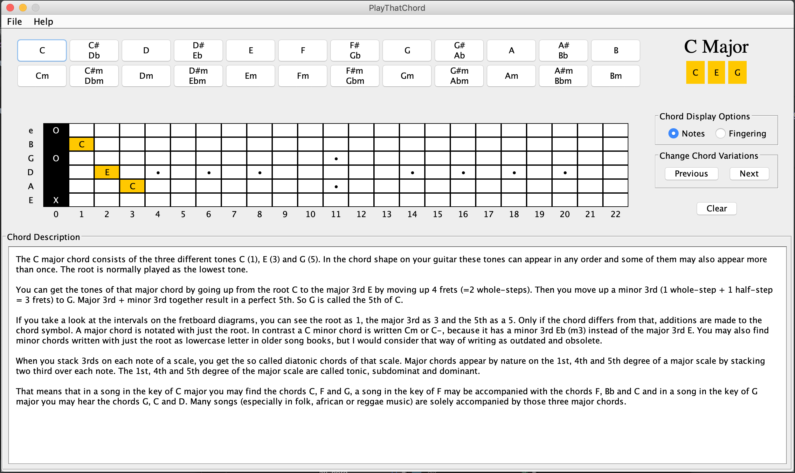

# PlayThatChord

This application allows users to find major and minor chord shapes and fingering on the guitar. 

## Running:
You can compile the project into a `jar` file.  
Or, you can just run the application by running `PlayThatChord.jar` file.

## Features: 
1. Major and minor chord shapes on the guitar
2. Major and minor chord fingerings on the guitar
3. Display different chord variations on the guitar
4. Help user understand how each chord is constructed

## Issues:
1. Currently sharp and flat chords are being treated the same. However, even though they have almost
the same frequency and place on the guitar, they are technically different. For next update, these chords
will be treated differently

